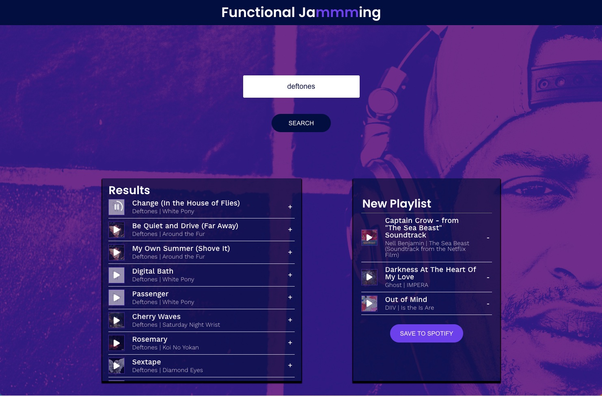

# Functional Jammming - The Codecademy project rewritten

Last update: april 11th 2023  

This is my solution to the [Jammming Project](http://jammming.s3-website-us-east-1.amazonaws.com), part of the Codecademy Front-End Developer Career Path.  
The project focused on using my knowledge of React components, passing state, and requests with the Spotify API to build a website that allows users to search the Spotify library, create a custom playlist, then save it to their Spotify account. 

## Table of contents

- [Overview](#overview)
  - [The challenge](#the-challenge)
  - [Screenshot](#screenshot)
  - [Links](#links)
  - [Built with](#built-with)
  - [What I learned](#what-i-learned)
  - [The next step](#the-next-step)
  - [Useful resources](#useful-resources)
- [Author](#author)
- [Acknowledgments](#acknowledgments)

## Overview

### The challenge

Whereas the original project was ment to be written using class components, I decided to challenge myself and rewrote the entire project using only function components.  
Also, I wanted to add the possibility to preview the tracks and to animate the playing preview with a micro animation of a circle filling up. 

### Screenshot



### Links

- Live Site URL: [https://functional-jammming.netlify.app/](https://functional-jammming.netlify.app/)

### Built with

- React 
- Function components
- SVG animation
- CSS Flexbox
- CSS Grid

### What I learned


**Using React hooks**  
Having the existing code, written in class components, as a starting point gave me a solid base to rewrite the components from classes to functions. While doing so I stumbled upon some new problems to solve, because function components obviously behave different then class components. But with some extra study on and appliance of my knowledge of React hooks such as the `useEffect` and `useRef` hook I managed to overcome these challenges.  

For example: in the class components version I could declare `timeoutId`'s by simply stating new timeoutId's using `this`:

```js
startResetTimer() {
    this.timeoutId = setTimeout(() => {
      this.setState({ 
        currentPreviewId: null,
        currentPreviewTrack: null });
    }, 30000);
}

stopResetTimer() {
    clearTimeout(this.timeoutId);
}
```

In function components on the other hand there is no `this` so I had to find a workaround to fix 'this' (paddum-tsss).   
The [React Documentation](https://react.dev/reference/react/useRef) brought the `useRef` hook to my attention, which I applied succesfully in the following way:

```js
const timeoutRef = useRef(null);

const startResetTimer= () => {
    const timeoutId = setTimeout(() => {
      setPreviewId(null);
      setPreviewTrack(null);
    }, 30000);
    timeoutRef.current = timeoutId;
};

const stopResetTimer = () => {
    const timeoutId = timeoutRef.current;
    clearTimeout(timeoutId);
};
```
  
**Creating the micro animation**  
In a [YouTube tutorial by Kevin Powell](https://www.youtube.com/watch?v=R00QiudbD4Y&t=253s) I came across the animation of hamburger menu's using SVG's. To create the animation of a circle forming while the preview played I transferred what I learned in this video and made my own SVG of a circle that could fill up using `stroke-dasharray`. 

In JS:
```js
<button className="Preview-button" data-state="isPlaying" onClick={() => onPause()}>
    <svg stroke="white" fill="none" className="Preview-circle" viewBox="0 0 100 100" width="36">
        <path
            className="line"
            strokeWidth="6"
            strokeLinecap="butt"
            d="m 50 10 A 1 1 0 0 1 50 90 A 1 1 0 0 1 50 10">
        </path>
    </svg>
</button>
```

In CSS:
```css
.Preview-button[data-state="isPlaying"] .line {
  animation: fillCircle 30s linear forwards;
}

@keyframes fillCircle {
  0% {
    stroke-dasharray: 0 250;
  }
  100% {
    stroke-dasharray: 251;
  }
}
```

### The next step  
*Right now the animation of the circle is static, but I would like it to reflect the actual current playstate / duration of the audio file. This way I can hopefully make it possible to kill this bug: if you trigger playing a track in the Search results and additionaly add it to the Playlist, the animation starts from 0 in the Playlist version of the track.*

UPDATE: I managed to make the animation of the circle responsive to the current playtime of the audio file, using `useRef` with a reference to the audio file in App.js:
```js
const initProgress = "0 250";
const [progress, setProgress] = useState(initProgress);
useEffect(() => {
  if (previewTrack) {
    const id = setInterval(() => {
      const calcProgress = ((Math.ceil(audioRef.current.currentTime * 8.4)).toString()) + " 250";
      setProgress(calcProgress);
    }, 100);
    return () => clearInterval(id);
  }
});
```
Then I import `progress` as prop in Track.js and assign it as value to the `stroke-dasharray` attribute, making the `@keyframes` animation in Track.css obsolete. 


Another addition I would've liked to explore is using the Color Thief plugin to return the dominant color in the artwork of the current preview track. I would use this color or the color palette to change the overall look of the Functional Jammming app.

### Useful resources

- [React Documentation](https://react.dev)
- [Spotify Developers - Web API reference](https://developer.spotify.com/documentation/web-api/reference/) 
- **Codecademy Front-End Engineer Career Path** on **React Function Components and Hooks**  

## Author

- Website - [Joost Steltenpool](https://jooststeltenpool.nl)
- LinkedIn - [@jooststeltenpool](https://www.linkedin.com/in/jooststeltenpool/)


## Acknowledgments

Many thanks to Codecademy for providing me with all the fundamental knowledge, React for their great documentation and to Kevin Powell for his awesome YouTube tips, tricks and tutorial videos.
